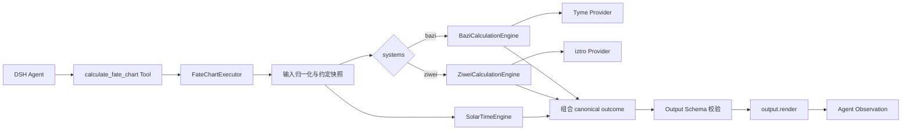

# `calculate_fate_chart` v0.1.0 开发技术方案

- 状态：Tyme 八字与 iztro 2.5.8 紫微运行时切片已实现；默认双系统和显式单系统已通过契约与 DSH Profile smoke
- 对应里程碑：[`../project/milestones/v0.1.0.md`](../project/milestones/v0.1.0.md)
- Tool 契约：[`../tool-layer.md`](../tool-layer.md)
- 原子能力审核稿：[`fate-chart-capability-contracts-v0.1.0.md`](fate-chart-capability-contracts-v0.1.0.md)
- 长期架构：[`../architecture.md`](../architecture.md)

本文只设计 v0.1.0 的工程实现，不冻结尚未确认的 Tool 字段、canonical output、错误码或命理默认值。出现冲突时，以用户确认的 ADR、Tool 契约和里程碑为准。

## 0. DSH 官方依据

本方案最初以 2026-08-16 核验的 DSH 官方仓库 revision `47f943859bef60e4160492346772ded9b24f765a` 为基线。实现时发现主仓库清单仍为 rc.5，而 npm 的最新完整发布线已经是 rc.6，因此切片 1 按 ADR 0012 锁定 `@deepseek-ai/dsh@0.1.0-rc.6`、`@deepseek-ai/dsh-tools@0.1.0-rc.6` 与 Cordis `4.0.1`，并用实际发布包重新验证 API 与 CLI。

| 本项目设计点         | DSH 官方依据                                                                                                                                                                                                                                                                                    | 落地约束                                                                                                                                          |
| -------------------- | ----------------------------------------------------------------------------------------------------------------------------------------------------------------------------------------------------------------------------------------------------------------------------------------------- | ------------------------------------------------------------------------------------------------------------------------------------------------- |
| 插件入口与生命周期   | [第一个插件](https://github.com/deepseek-ai/deepseek-harness/blob/47f943859bef60e4160492346772ded9b24f765a/docs/user/develop/basic/index.zh.md)                                                                                                                                                 | 导出 `apply(ctx)`；消费 `tools` 时声明 `inject = ['tools']`；通过 `ctx` 注册的能力随插件卸载自动清理                                              |
| Tool Schema 与返回值 | [创建 Tool](https://github.com/deepseek-ai/deepseek-harness/blob/47f943859bef60e4160492346772ded9b24f765a/docs/user/develop/basic/tool.zh.md)、[Tool 编写参考](https://github.com/deepseek-ai/deepseek-harness/blob/47f943859bef60e4160492346772ded9b24f765a/docs/cookbook/adding-a-tool.zh.md) | `parameters` 校验模型参数；`execute()` 只返回 `output.schema` 声明的 canonical JSON；`output.render()` 纯投影模型内容；前台计算贯穿 `exec.signal` |
| 插件配置             | [插件配置](https://github.com/deepseek-ai/deepseek-harness/blob/47f943859bef60e4160492346772ded9b24f765a/docs/user/develop/basic/config.zh.md)                                                                                                                                                  | 只有真实部署可调项才进入导出的 `Config`/Schemastery；命理业务输入不放进 Cordis Config                                                             |
| 本地调试             | [第一个插件](https://github.com/deepseek-ai/deepseek-harness/blob/47f943859bef60e4160492346772ded9b24f765a/docs/user/develop/basic/index.zh.md)                                                                                                                                                 | 外部插件先构建，再生成带绝对 `lib/index.js` 入口的本地 overlay；rc.6 用 `dsh --profile web --patch <overlay>` 加载，绝对路径不得提交              |
| Bundle 与 Profile    | [打包与安装插件](https://github.com/deepseek-ai/deepseek-harness/blob/47f943859bef60e4160492346772ded9b24f765a/docs/user/develop/basic/publish.zh.md)、[CLI](https://github.com/deepseek-ai/deepseek-harness/blob/47f943859bef60e4160492346772ded9b24f765a/apps/cli/README.zh.md)               | `dsh.bundle` 是 `package.json` manifest，不是独立文件；它指向包内 `cordis.patch.yml`；Profile 由 `dsh plugin --profile` 管理                      |
| 安装与检查           | [打包与安装插件](https://github.com/deepseek-ai/deepseek-harness/blob/47f943859bef60e4160492346772ded9b24f765a/docs/user/develop/basic/publish.zh.md)                                                                                                                                           | tarball 安装后先执行 `dsh --profile <name> --dump-config`，确认 bundle 层与插件行，再启动 Profile                                                 |

官方资料把 Service 定义为“向其他插件提供的能力”。v0.1.0 只消费 `tools` 并注册排盘 Tool，不额外提供 Cordis Service；只有出现第二个插件消费者时才重新评审 Service 边界。同一插件可以多次向 Tool registry 注册独立 Tool，v0.1.0 的单 Tool 是版本范围，不是 DSH 限制或长期架构限制。

v0.1.0 的 DSH 表面决策：

| 表面          | 本版决定                                                                                                                                             |
| ------------- | ---------------------------------------------------------------------------------------------------------------------------------------------------- |
| Tool          | 本版只注册 `calculate_fate_chart`；后续干支历 Tool 进入独立里程碑                                                                                    |
| Service       | 不提供；八字／紫微 engine 是包内端口，不注册到 Cordis                                                                                                |
| Tool Schema   | 必须由用户审核 input、canonical output 和错误语义后实现                                                                                              |
| Cordis Config | 初版不为了形式创建空 Config。命理计算约定来自显式 Tool 参数或用户确认的稳定默认；只有出现 timeout、资源路径等真实部署差异时才新增 Schemastery Config |

## 1. 业务定义

`calculate_fate_chart` 完成一个任务：把一次出生信息请求编排成八字、紫微或两者的可靠命盘事实，并交给 DSH Agent 继续分析。

业务流程固定为：

1. DSH 根据 Tool Schema 收集并校验模型参数。
2. 唯一的 `FateChartExecutor` 归一化共享输入，冻结本次计算约定。
3. Executor 根据 `systems` 路由：只执行八字引擎、只执行紫微引擎，或执行两者。
4. 八字与紫微引擎各自调用独立 Provider，返回本项目领域结果，不泄漏第三方对象。
5. Executor 组合各引擎结果并产出 canonical outcome。
6. DSH `output.render()` 把 canonical value 纯投影为模型可见 Observation。

`systems` 省略时选择两套系统；显式为 `bazi` 时不得调用紫微引擎，显式为 `ziwei` 时不得调用八字引擎。

## 2. 与 Moya 工具分层的对应关系

| Moya                             | dsh-fate-spectrum                                 | 职责                                               |
| -------------------------------- | ------------------------------------------------- | -------------------------------------------------- |
| `@tool`、`args_schema`、registry | DSH `defineTool()`、`parameters`、`output.schema` | 模型可见名称、描述、输入输出契约                   |
| `BaseExecutor` / 具体 Executor   | `FateChartExecutor`                               | 工程编排、路由、容错和结构化结果                   |
| Executor 调用后端或工程能力      | Executor 调用八字、紫微、时间等原子计算引擎       | 执行确定性业务能力                                 |
| `ToolResult`                     | canonical execution outcome                       | 程序可校验的工程结果                               |
| registry `_to_observation()`     | DSH `output.render()`                             | 把工程结果翻译成模型能理解和继续行动的 Observation |

因此本项目不是“一个 Tool 对应两个 Executor”。一个排盘任务只有一个 `FateChartExecutor`；八字和紫微是它引用的两个独立原子计算引擎，Tyme 与 iztro 则分别是引擎背后的 Provider。

## 3. 运行链路



### 3.1 Tool 注册层

只负责：

- 注册 `calculate_fate_chart` 的名称、描述、parameters 和 output schema。
- 把 DSH 已校验参数映射成框架无关的执行请求，再交给 `FateChartExecutor`。
- 传递 `AbortSignal`。
- 让 `output.render()` 调用纯 Observation projector。
- 通过 Cordis `inject = ['tools']` 等待 Tool registry，并依赖 Cordis 自动清理注册。

不负责：出生信息归一化、系统路由、历法算法、Provider 异常分类、`partial` 决策或命盘文本拼接。

官方当前说明：函数插件足以消费 `tools` 并注册能力；只有本插件未来需要向其他插件提供有生命周期的 Service 时，才考虑 Cordis class 形式。

### 3.2 `FateChartExecutor`

Executor 是 v0.1.0 唯一的任务级执行器，负责：

- 接收框架无关的执行请求并建立本次调用的只读状态。
- 一次性归一化出生信息和地点/时间输入。
- 一次性解析 `systems`、时间与流派约定，形成只读调用快照。
- 根据 `systems` 选择需要执行的原子引擎。
- 将共享输入问题转换为已冻结的 canonical outcome。
- 组合两个引擎的成功、安全失败和警告，决定 `success`、`partial` 或其他稳定状态。
- 在返回前校验顶层不变量。

Executor 不拥有：第三方 API 细节、藏干/星曜算法、DSH ContentBlock、Session、Memory、缓存、当前用户或最近命盘。

Executor 适合使用 class，只因为它需要持有注入的引擎依赖；所有调用数据仍是方法内只读值，class 实例不得保存调用结果。

### 3.3 原子计算引擎

#### 出生时刻校准引擎

输入：民用出生时间、IANA timezone、经纬度、校准模式和已解析规则。

输出：实际用于排盘的时间、UTC 对照、跨日信息、算法版本与精度 provenance。

职责：完整视太阳时或明确的民用时处理。它只服务排盘任务，由 `FateChartExecutor` 在内部调用，不注册独立 Tool，也不与后续干支时间范围 Tool 混用；同时不隐藏在八字 Provider 内，也不负责地点文本猜坐标。

#### 八字计算引擎

输入：归一化出生信息、已解析八字约定、请求 section、校准后的时间和取消信号。

输出：本项目定义的八字领域结果，包括原局、藏干、十神、纳音、旬空、十二长生、起运与大运等已验收字段。已知时辰返回一个四柱候选；未知时辰枚举全天并压缩三柱候选，省略全部时柱相关事实。

职责：调用八字 Provider 端口，校验并映射八字事实。它不决定是否还要排紫微，也不生成顶层 `partial`。

#### 紫微计算引擎

输入：归一化出生信息、已解析紫微约定、请求 section、校准后的时间和取消信号。

输出：本项目定义的紫微领域结果，包括十二宫、命身宫锚点、命主身主、五行局、星曜、亮度、四化和大限等已验收字段。已知时辰返回一份命盘；未知时辰返回早子至晚子十三份候选盘。

职责：调用紫微 Provider 端口，校验并映射紫微事实。它不读取八字结果，也不生成顶层 `partial`。

#### 后续干支历 Tool 与干支作用引擎

“下周／下下周／明确日期范围”属于后续独立干支历 Tool，由自己的任务级 Executor 生成公历、农历、节气、流年、流月和逐日干支上下文。原局、大运、流年、流月、流日和时辰下的干支作用则是另一项未来原子能力。v0.1.0 不创建这些能力的空目录、空接口或假字段；只有进入对应里程碑并定义输入、输出、规则 ID 和独立验收时才新增。

### 3.4 Provider

Provider 只适配具体第三方实现：

- Tyme Provider：第三方八字对象与异常到八字领域类型的防腐层。
- iztro Provider：第三方紫微对象、设置与异常到紫微领域类型的防腐层。
- Solar-time Provider：若完整视太阳时采用独立算法实现，向时间引擎提供可替换计算端口。

Provider 不接收 DSH Tool 参数对象，不返回 Observation，不决定默认 `systems`，不保存跨调用可变设置。若第三方库只有模块级全局配置，先通过探针决定实例隔离、调用级恢复或保守串行策略。

### 3.5 Canonical outcome 与 Observation

`FateChartExecutor` 返回 canonical value；DSH 依据 `output.schema` 校验后，`output.render()` 将它转换为 Observation。

这样分离的理由不是追求层数，而是保护两个消费者：

- Code Mode 或程序调用者需要稳定 JSON。
- Agent 需要紧凑、行动导向的文本或 ContentBlock。

Observation projector 不重新计算、不修正错误分类、不访问 Session/Memory/网络/时钟，也不把完整工程 JSON 重复塞回模型上下文。

### 3.6 DSH 开发与交付双闭环

源码调试闭环反复运行，不等待发布打包：

```text
实现一个最小行为
  -> 构建 lib/index.js
  -> 生成 .local/dsh/cordis.dev.yml（绝对构建入口）
  -> dsh --profile web --patch .local/dsh/cordis.dev.yml
  -> 验证插件加载、Tool Schema、调用、取消和 Observation
  -> 修改后重新加载并回归
```

交付闭环只在源码行为通过后进入：

```text
pnpm run build
  -> package.json 声明 dsh.bundle.patch
  -> cordis.patch.yml 引用包名入口
  -> pnpm pack
  -> dsh plugin --profile fate-spectrum-dev add <tarball>
  -> dsh --profile fate-spectrum-dev --dump-config
  -> 启动 Profile 完成 tarball smoke
  -> 用户授权后才进入 GitHub / npm / Release 分发
```

发布物最小组成是 `package.json`、`cordis.patch.yml`、`lib/`、README、LICENSE 和第三方声明。开发 overlay 与 Profile 运行数据放在 `.local/`，不进入 npm 包。

分发策略：

- **tarball**：v0.1.0 首个真实交付证据；不需要安装时构建授权，最适合冻结发布候选。
- **npm**：发布前已经构建 `lib/`；只有用户明确授权后执行。
- **GitHub 源码安装**：pnpm 不会自动执行普通 `build`。若未来支持，必须提供自包含 `prepare`，并由安装者在 Profile 的 `pnpm-workspace.yaml` 中显式允许 `allowBuilds`；v0.1.0 不把它作为首要验证路径。

## 4. 当前目录结构

切片 1 只打开已经承担真实职责并有测试的边界：

```text
src/
├── index.ts
├── adapters/dsh/
│   └── calculate-fate-chart.tool.ts
├── contracts/calculate-fate-chart/
│   ├── schemas.ts
│   ├── map-request.ts
│   └── map-result.ts
├── domain/
│   ├── calculation-outcome.ts
│   ├── execution-context.ts
│   ├── fate-chart-conventions.ts
│   ├── fate-system.ts
│   └── normalized-birth.ts
├── application/
│   └── fate-chart/
│       ├── fate-chart.executor.ts
│       └── resolve-conventions.ts
├── capabilities/
│   ├── bazi/
│   │   ├── bazi.engine.ts
│   │   ├── bazi.model.ts
│   │   ├── provider-backed-bazi.engine.ts
│   │   └── unavailable-bazi.engine.ts
│   ├── time/
│   │   ├── baseline-time.engine.ts
│   │   ├── time.engine.ts
│   │   └── time.model.ts
│   └── ziwei/
│       ├── ziwei.engine.ts
│       ├── ziwei.model.ts
│       ├── provider-backed-ziwei.engine.ts
│       └── unavailable-ziwei.engine.ts
├── providers/bazi/
│   ├── bazi.provider.ts
│   └── tyme-bazi.provider.ts
├── providers/ziwei/
│   ├── ziwei.provider.ts
│   └── iztro-ziwei.provider.ts
└── projections/observation/
    └── render-fate-chart-observation.ts

tests/
├── contract/calculate-fate-chart.tool.test.ts
├── fixtures/synthetic-bazi-chart.ts
├── fixtures/synthetic-ziwei-chart.ts
├── integration/plugin-registration.test.ts
├── unit/application/fate-chart.executor.test.ts
├── unit/providers/tyme-bazi.provider.test.ts
└── unit/providers/iztro-ziwei.provider.test.ts

scripts/
├── create-dsh-dev-patch.mjs
└── probes/
    ├── tyme-bazi.mjs
    └── iztro-ziwei.mjs
```

后续目录只在对应审核点开启。切片 1 已打开 DSH Adapter、契约和 Observation 目录；表中相应条件已经满足：

| 目录或文件                                                                     | 开启条件                                            |
| ------------------------------------------------------------------------------ | --------------------------------------------------- |
| `contracts/calculate-fate-chart/`、`adapters/dsh/`、`projections/observation/` | 已开启；当前公开八字 success/partial 与安全失败结果 |
| `.local/dsh/cordis.dev.yml` 生成脚本                                           | 已开启；生成物继续统一忽略                          |
| `providers/bazi/`                                                              | 已开启；Tyme 探针通过且八字输入输出获用户批准       |
| `providers/solar-time/`                                                        | 完整视太阳时算法和来源获用户批准                    |
| `providers/ziwei/`                                                             | 已开启；iztro 探针通过且紫微输入输出获用户批准      |
| `cordis.patch.yml` 与 `package.json#dsh.bundle`                                | 源码 `--patch` 行为稳定，进入 tarball/Profile 切片  |
| `tests/contract/`、`tests/golden/`、`tests/integration/`                       | 相应公共契约、真实 Provider 或 DSH 组装边界出现     |

## 5. 文件职责与依赖方向

| 位置                                            | 唯一职责                                              | 允许依赖                                | 禁止依赖                             |
| ----------------------------------------------- | ----------------------------------------------------- | --------------------------------------- | ------------------------------------ |
| `domain/*`                                      | 共享不可变领域值、执行上下文和逐能力 outcome          | TypeScript / Node 标准类型              | DSH、Tyme、iztro、UI、网络           |
| `application/fate-chart/fate-chart.executor.ts` | 唯一排盘任务编排器；按已归一化 `systems` 顺序调用能力 | domain、capability ports                | DSH、具体 Provider、模型文案         |
| `capabilities/*/*.model.ts`                     | 某项原子能力的框架无关输入输出                        | domain                                  | DSH Schema、另一体系模型、第三方对象 |
| `capabilities/*/*.engine.ts`                    | 某项原子能力端口                                      | 本能力 model、domain outcome            | 具体第三方包、Observation            |
| `unavailable-*.engine.ts`                       | Provider 未交付时返回明确内部失败，不生成假盘         | 对应 capability port                    | canonical 状态决定、模型文案         |
| `contracts/calculate-fate-chart/*`              | 用户批准的公共 Tool 输入输出契约与双向 mapper         | DSH Schema DSL、application result      | Provider 实现、Session               |
| `providers/*`                                   | 第三方调用、异常分类、对象映射和版本来源              | capability port、domain、对应第三方包   | DSH、Tool Schema、Observation        |
| `projections/observation/*`                     | canonical value 到模型内容的纯投影                    | contracts                               | Provider、Session、网络、时钟        |
| `adapters/dsh/*`                                | `defineTool`、Schema mapping、取消传递和 Tool 组装    | DSH、contracts、application、projection | 第三方算法细节                       |

`index.ts` 是轻量 composition root：只导出插件入口并组装已审核的 engine/provider 依赖，不承载业务逻辑、字段映射或兼容补丁。

## 6. 已确认的 Tool Schema 方向

DSH 官方 `defineTool()` 从 `parameters` 推导并校验模型参数，`execute()` 返回 `output.schema` 声明的 canonical JSON，`output.render()` 再生成模型内容。Schema 因此既是模型调用界面，也是 Code Mode 的程序接口，不能由第三方 Provider 对象倒推出来。

### 6.1 输入提案

首版只保留完成排盘所需字段：

| 字段             | 提案语义                            | 审核重点                                                |
| ---------------- | ----------------------------------- | ------------------------------------------------------- |
| `birth.calendar` | `gregorian` 或 `lunar`              | 农历闰月使用显式字段，不让 Provider 猜测                |
| `birth.date`     | 年、月、日三个整数                  | 不让 Provider 自行解析自然语言日期                      |
| `birth.time`     | `known` 与 `unknown` 的显式联合     | 未知绝不映射成 `00:00`；已知分支才允许时、分            |
| `birth.location` | 标签、IANA timezone、经度和可选纬度 | 文本标签不等于坐标；完整视太阳时缺经度时如何修复        |
| `gender`         | `male` 或 `female`                  | 满足起运顺逆与两套命盘计算要求                          |
| `systems`        | `bazi`／`ziwei` 数组，省略默认两者  | 空数组、重复值和单系统路由由 Schema 与 Adapter 明确处理 |
| `conventions`    | 时间、八字与紫微的显式约定          | 全部默认来自统一解析器，并在结果中披露默认或显式来源    |

`name`、`relation`、`include`、`referenceDate` 和 `locale` 不进入首个可运行 Schema。后续干支历 Tool 独立承载时间范围，不向排盘 Tool 追加 `referenceDate`。渐进披露和本地化只有在真实调用证明确有需要时才审核扩展。

已确认八字默认约定：

- `dayBoundary: zi_hour_next_day`，先真太阳时校准、后按实际排盘时间 23:00 换日。
- `luckStart: lunar_sect_1`。
- `late_zi_same_day` 与其他 Tyme 起运算法保留为显式选项并随结果披露。

已确认紫微默认约定：

- `school: standard`，保留 `zhongzhou` 显式选项。
- `leapMonthRule: split_at_day_15`，保留 `whole_leap_month` 显式选项。
- 四化与亮度固定使用 `iztro@2.5.8` 内置规则，不开放自定义表。
- 未知出生时辰返回十三份合法候选，详见 [ADR 0014](../project/decisions/0014-ziwei-v0-1-contract-and-defaults.md)。

### 6.2 输出提案

输出维持四种顶层结果候选：`success`、`partial`、`needs_clarification`、`unsupported`。每个系统结果都有自己的状态与来源，不能通过“字段缺失”暗示失败。

运行时 `0.1.0-dev.3` 已接入两套真实 Provider：仅八字、仅紫微和默认双系统均可返回 `success`。一套成功而另一套发生可安全分类的 Provider 失败时仍返回 `partial`；共享输入失败、输出不变量破坏或非预期基础设施异常不降级为 `partial`。人工 fixture 只用于测试，不参与运行时成功结果。

### 6.3 单一来源与隔离方式

1. DSH Adapter 持有模型可见 `parameters` 与 `output.schema`。
2. Adapter 是 DSH args 到框架无关 `FateChartExecutionRequest` 的唯一映射边界。
3. Executor 和原子引擎不 import DSH Schema 类型；Tool 字段变化只修改 Schema、mapper 与 contract tests。
4. 原子引擎输出先通过领域不变量校验，再由 Executor 组合，最后接受 DSH output schema 校验。
5. 不手写一份与 DSH Schema 逐字段重复、却没有自动一致性证据的公共 interface。

首个 `defineTool()` 切片开始前的业务审核已经完成；实现时必须把本节落为可执行 Schema 与契约测试，不能借实现擅自增加字段。

## 7. 实现切片与用户审核点

### 切片 0：内部骨架与审核面

目标：先让边界在 TypeScript 中成立，不注册 Tool、不安装 DSH 或命理 Provider，也不把待确认字段伪装成公共契约。

- 建立唯一 `FateChartExecutor`、八字／紫微 engine port、显式未知时辰领域值和逐系统 outcome。
- 用人工构造引擎验证单系统路由、双系统隔离、取消信号和未实现紫微不产生假命盘。
- 提交 Tool Schema、八字、紫微和时间能力输入输出清单给用户审核。

### 切片 1：排盘 Tool Schema 与 DSH 本地纵向骨架

目标：用户冻结首版 Schema 后，用人工构造结果跑通 `defineTool → Executor → output.render()`。

- 安装锁定 DSH/Cordis 依赖，导出函数插件和 `inject = ['tools']`。
- 实现已审核的 parameters、output schema、Adapter mapping 和纯 Observation projector；大运使用“交运年份 + 周岁范围”，不输出歧义裸年龄。
- 生成 `.local/dsh/cordis.dev.yml`，通过 `dsh web --patch` 验证 Tool 发现、缺参拒绝、调用、取消和 Observation。
- 本切片仍不声称已经具备真实排盘能力。

### 切片 2：八字 Provider 探针与计算决策

目标：先把 Tyme 和完整视太阳时所需能力验证清楚，再写八字正式 Adapter。

- 核验精确版本、许可证、维护状态、日期范围、模块级设置和未知时辰行为。
- 用人工构造案例验证本版字段、边界、重复确定性和 A/B 隔离。
- 未知时辰候选、太阳时地点交互精度、换日与起运默认已经冻结；完整视太阳时的数据源和校准算法仍在独立切片验证。
- 探针与规划不一致时暂停，先更新业务输入输出与契约。

### 切片 3：八字核心计算纵向交付

目标：让 `systems: ['bazi']` 取得第一份真实、完整、可验证的命盘事实。

- 实现排盘内部出生时刻校准能力、Tyme Provider 映射和八字引擎，不让 Tyme 类型越过 Provider。
- Tyme 流派 Provider 的共享可变配置必须在调用级恢复并保守串行，增加不同流派 A/B 隔离测试。
- 验证原局、藏干、十神、纳音、旬空、起运和大运等用户批准字段。
- 通过人工构造 golden、Provider contract、重复确定性、禁网和跨调用隔离测试。
- 在真实 DSH Tool Loop 中验证仅八字请求；紫微仍返回明确未交付 outcome，不返回预设命盘。

### 切片 4：默认双系统的阶段性行为

目标：在紫微开发前，让默认请求诚实返回真实八字结果和明确紫微状态。

- 用户冻结“仅紫微”的 unsupported 语义，以及默认双系统的 `partial` 语义。
- 验证成功系统数据和未完成系统信息同时存在，模型不会把紫微缺失误当成空盘。
- `output.render()` 只呈现真实八字事实与下一步，不重复完整 canonical JSON。

### 切片 5：紫微原子计算引擎

目标：独立交付并审核紫微计算能力，再解除阶段性未完成状态。

- 先完成 iztro 探针，由用户确认紫微未知时辰、闰月、流派、四化和亮度规则。
- 实现 iztro Provider、映射和紫微引擎。
- 验证十二宫、命身宫、命主身主、五行局、星曜、四化和大限。
- 通过人工构造 golden、Provider contract、重复确定性、禁网和跨调用隔离测试。

状态：已实现并通过 27 项全仓测试；显式流派、闰月、十三候选、Observation 上限和配置恢复均有契约证据。

### 切片 6：真实双系统组合

目标：解除紫微占位失败，冻结默认双排盘、显式单系统和安全部分成功语义。

- 验证共享输入失败不启动任一引擎。
- 验证默认双排盘和两个显式单系统请求。
- 验证一套安全 Provider 失败时 `partial` 的成功数据和失败信息都完整。
- 验证输出不变量、程序错误和非预期基础设施异常继续向 DSH 抛出。
- 通过 A/B 调用隔离后再决定是否声明并发安全。

状态：默认双系统与两个显式单系统已通过；保守并发声明保持不变，真实用户 DSH 复核仍待完成。

### 切片 7：Bundle、Profile 与发布候选

目标：从实际 tarball 安装到锁定 DSH Profile，完成用户真实体验验收。

- 构建 `lib/`，完成 `package.json` 的 `dsh.bundle` manifest 与包内 `cordis.patch.yml`。
- `pnpm pack` 后通过 `dsh plugin --profile fate-spectrum-dev add <tarball>` 安装。
- `dsh --profile fate-spectrum-dev --dump-config` 验证 bundle 层，再启动 Profile。
- Tool 发现、缺参追问、执行、Observation、后续分析、断网、隐私和包内容全部通过。
- 用户确认用户可见能力后再更新 README；Tag、Release 和 npm 发布仍需单独明确授权。

## 8. 分层验证

| 审核对象           | 最小证据                                                             |
| ------------------ | -------------------------------------------------------------------- |
| Tool Schema        | accept/reject、默认值、跨字段和 output schema contract tests         |
| Executor 路由      | 人工构造引擎调用次数、参数快照、单/双系统、无多余引擎调用            |
| 组合语义           | success、可修复失败、unsupported、partial、throw 边界穷尽测试        |
| 时间引擎           | timezone、longitude、DST、跨日、均时差和 provenance 独立案例         |
| 八字引擎           | Provider contract、人工构造 golden、边界、重复确定性、禁网           |
| 紫微引擎           | Provider contract、人工构造 golden、十二宫不变量、重复确定性、禁网   |
| Observation        | 纯函数 snapshot、token 预算、失败行动语义、不重复完整 canonical JSON |
| Cordis/DSH Adapter | `inject`、自动清理、Profile patch、真实 Tool Loop、取消与静止状态    |
| Package            | frozen install、build、pack、tarball 安装、DSH load smoke            |

## 9. 本方案尚未拍板的事项

- 完整视太阳时的离线地点来源、均时差算法、精度与跨日行为；城市／区县交互粒度已经确认。
- Provider 全链路的最终并发声明；Tyme 与 iztro 当前都按共享配置保守串行并恢复状态。
- 发布候选的 Bundle manifest、实际 tarball 内容和干净 Profile 安装结果。
- 用户在真实 DSH 中对默认双系统、显式紫微和未知时辰十三候选的最终体验验收。

这些事项必须按切片逐项由用户审核，不能因为目录树已经画出就视为默认同意。

## 10. 明确不做

- 本里程碑不提前实现后续干支历 Tool、周报 Skill、A2UI 或第二个 Agent Loop；长期多 Tool 边界不因此撤销。
- 不把八字和紫微合并成一个计算引擎，也不拆成两个任务级 Executor。
- 不实现干支作用、Knowledge/RAG、Memory、数据库、缓存、自定义 UI 或 Python 服务。
- 不使用真实生日形成公共测试或文档示例。
- 不让 Provider、模型或 UI 猜测未知时间、坐标和流派默认值。
