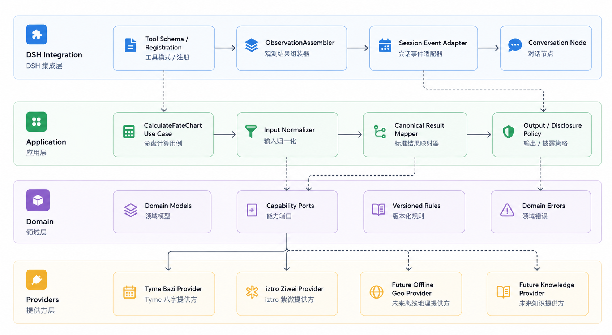

# v0.1.0 里程碑：统一命盘排盘

- 状态：活动
- 用户评审面：本文件
- 长期架构：[`../../architecture.md`](../../architecture.md)
- Tool 契约：[`../../tool-layer.md`](../../tool-layer.md)
- 当前状态：[`../PROJECT_STATE.md`](../PROJECT_STATE.md)

## 1. 版本结果

用户提供一次出生信息后，DSH Agent 调用唯一的 `calculate_fate_chart`：

- 默认同时计算四柱八字与紫微斗数。
- 可以明确只计算八字或只计算紫微。
- 需要时使用完整视太阳时校准，并披露时间、地点与算法依据。
- 返回稳定的程序结果，再投影为适合 Agent 继续分析的 Observation。

本版本只建立可靠命盘底图，不提供解释性预测、周报、干支作用引擎、Knowledge/RAG、Memory 或自定义命盘 UI。



## 2. 已确认边界

- 只暴露一个模型可见 Tool：`calculate_fate_chart`。
- `systems` 支持八字、紫微或两者；省略时默认两者。
- 八字与紫微使用两个独立 Provider/Executor。
- 太阳时是独立计算能力，不隐藏在八字 Provider 内。
- `name`、`relation` 选填且不影响计算事实。
- 可修复输入和领域失败返回 canonical outcome。
- 同时请求两套系统时，一套成功、另一套发生可安全分类的独立 Provider 失败，返回显式 `partial`。
- 只有不变量破坏、程序缺陷或非预期基础设施异常向 DSH 抛出。
- 未知出生时辰保持明确未知，不补成 `00:00`。
- 运行时不访问 LLM、第三方排盘网站、在线地理编码、数据库或缓存。
- 不实现第二个 Agent Loop、Python 服务、Memory、RAG 或自定义 UI。

公共 Tool Schema、canonical result、错误语义和 Observation 只以 `docs/tool-layer.md` 为准。

## 3. 技术基线

| 项目          | 基线                              |
| ------------- | --------------------------------- |
| Node.js       | 官方范围 `^22.19.0 \|\| >=24.0.0` |
| 本地 Node.js  | `24.19.0`                         |
| pnpm          | `11.7.0`                          |
| Module        | ESM，`"type": "module"`           |
| TypeScript    | Strict，公共边界运行时校验        |
| 测试          | Vitest，人工构造数据              |
| DSH           | 精确预览版本待集成前核验          |
| 八字 Provider | 候选 Tyme，精确版本待探针         |
| 紫微 Provider | 候选 iztro，精确版本待探针        |

依赖只能在对应阶段获得用户确认后安装。版本和许可证审核通过前，不冻结 Provider 选择。

## 4. 目标代码结构

以下代码树是本里程碑的目标职责边界。Provider 探针发现真实 API 与设计不一致时，先更新本文件并由用户确认，不直接绕过边界实现。

```text
src/
├── index.ts
├── domain/
│   ├── birth.ts                  # 归一化出生信息与时间精度
│   ├── conventions.ts            # 已解析计算约定快照
│   ├── bazi.ts                   # 八字领域事实
│   ├── ziwei.ts                  # 紫微领域事实
│   ├── fate-chart.ts             # 统一命盘文档与不变量
│   ├── provenance.ts             # 算法、地点、时间与 Provider 来源
│   ├── errors.ts                 # DomainResult 与领域错误
│   └── ports.ts                  # 八字、紫微、太阳时端口
├── application/
│   ├── normalize-birth-input.ts  # Tool 输入到领域输入
│   ├── resolve-conventions.ts    # 一次调用的只读配置快照
│   ├── calculate-fate-chart.ts   # 双 Provider 编排与 partial 决策
│   └── map-tool-result.ts        # 领域结果到 canonical result
├── contracts/
│   ├── calculate-fate-chart.input.ts
│   └── calculate-fate-chart.result.ts
├── providers/
│   ├── solar-time/
│   │   ├── calculate-apparent-solar-time.ts
│   │   └── index.ts
│   ├── bazi/
│   │   ├── adapter.ts
│   │   ├── mapper.ts
│   │   └── index.ts
│   └── ziwei/
│       ├── adapter.ts
│       ├── mapper.ts
│       └── index.ts
├── observation/
│   └── calculate-fate-chart.ts   # canonical result 到 Agent Content
└── adapters/
    └── dsh/
        ├── plugin.ts             # Cordis 生命周期与依赖注入
        ├── calculate-fate-chart.tool.ts
        └── prompt-section.ts

tests/
├── unit/                         # Domain、归一化、约定和纯投影
├── contract/                     # Provider、Tool input/output Schema
├── integration/                  # Application 组合与 DSH Adapter
├── golden/                       # 独立复核的合成边界盘
└── fixtures/                     # 仅人工构造数据
```

### 结构调整原则

- 同一目录只有一个简单实现时，可以先合并文件，不能为了匹配树而制造空壳。
- Provider 的真实 API 证明需要额外隔离时，可以在对应目录内增加具名模块。
- 不新增通用 `utils/`、全局注册表、用户缓存或可变 Singleton。
- 不拆多 Package；只有独立运行时或客户端消费者出现后再评估。

## 5. 开发顺序与 TODO

### A. Provider 探针

- [ ] 用户确认精确候选依赖、安装范围和探针命令。
- [ ] 安装并记录 Tyme 的精确版本、许可证和包体信息。
- [ ] 验证公历/农历、闰月、节气边界、四柱、藏干、十神、纳音、旬空、起运与大运 API。
- [ ] 安装并记录 iztro 的精确版本、许可证和包体信息。
- [ ] 验证十二宫、命身宫、命主身主、五行局、星曜、亮度、四化、大限、闰月和流派设置。
- [ ] 验证两套 Provider 的模块级可变状态、重复确定性和 A/B 调用隔离。
- [ ] 用人工构造输入验证未知时辰时 Provider 实际能够返回什么。
- [ ] 形成探针记录，列出能力吻合、缺失、差异和许可证风险。
- [ ] 停止并由用户决定未知时辰字段、换日、太阳时、闰月和紫微默认设置。

### B. Tool 契约冻结

- [ ] 根据探针结果复审 `docs/tool-layer.md`。
- [ ] 冻结 Input Schema、Output Schema、canonical outcome 和稳定错误码。
- [ ] 冻结 `include` sections 和 Observation 行动语义。
- [ ] 为所有公共状态建立 Schema accept/reject 契约案例。
- [ ] 用户确认契约 diff 后再进入实现。

### C. Domain 与 Application

- [ ] 建立运行时 Schema 到 TypeScript 类型的单一来源。
- [ ] 实现出生输入归一化和只读计算约定快照。
- [ ] 实现领域事实、Provenance、不变量和判别联合结果。
- [ ] 实现八字、紫微和太阳时独立端口。
- [ ] 实现默认双排盘、单系统请求和 `partial` 组合逻辑。
- [ ] 实现 canonical result 映射，不泄漏第三方对象和异常。

### D. Providers

- [ ] 实现完整视太阳时离线计算与独立参考案例。
- [ ] 实现八字 Provider Adapter 与领域映射。
- [ ] 实现紫微 Provider Adapter 与领域映射。
- [ ] 约定全部显式传入 Provider，禁止隐藏默认值。
- [ ] 通过重复确定性、禁网和 A/B 隔离测试。

### E. Observation 与 DSH Adapter

- [ ] 实现无副作用 Observation 投影和渐进 section 披露。
- [ ] 使用锁定版本的 DSH/Cordis API 注册唯一 Tool。
- [ ] 将 `AbortSignal` 贯穿 Application 和 Provider。
- [ ] 所有 Cordis 注册和资源均可在卸载时释放。
- [ ] 未证明并发安全前保持保守串行声明。
- [ ] 在真实 DSH Profile 中验证 Tool 发现、参数补问、执行和后续 Agent 分析。

### F. 发布候选

- [ ] 运行完整格式、Lint、Typecheck、Unit、Contract、Golden、Offline 和隔离测试。
- [ ] 构建并安装实际 tarball。
- [ ] 在干净 Profile 中完成打包产物 DSH smoke。
- [ ] 审核包内容、许可证、隐私、README 当前能力和产品版本摘要。
- [ ] 冻结已知限制和 DSH 兼容范围。
- [ ] 用户确认里程碑完成后归档。
- [ ] 再次获得明确授权后，才允许 push、Tag、Release 或 npm 发布。

## 6. 用户决策门

以下变化必须先在本文件列出影响和候选方案，再等待用户决定：

- Provider 能力与本里程碑范围不一致。
- Tool Schema、canonical result、错误语义或 Observation 行动发生变化。
- 未知时辰能够返回哪些字段。
- 23 点换日、太阳时、闰月、起运或紫微流派默认值。
- DSH 官方 API 与现有设计不一致。
- 出现许可证风险、需要真实生日或计划外网络访问。
- 想新增 Tool、服务、数据库、缓存、Python、UI、Memory、RAG 或第二个 Agent Loop。

## 7. 完成定义

v0.1.0 只有同时满足以下条件才可标记完成：

- 一个 `calculate_fate_chart` 能在 DSH 中被发现和正确调用。
- 默认同时返回八字与紫微，显式选择单系统有效。
- 两套 Provider 独立，调用之间不串状态。
- 时间校准和计算约定可追溯，未知值不被猜测填充。
- canonical outcome、`partial` 和异常边界符合冻结契约。
- Observation 足以支持 Agent 继续追问或分析，不重复整份工程 JSON。
- 断网可计算，公共证据不包含真实生日和私人资料。
- 实际 tarball 可安装并通过锁定 DSH 版本的 Profile smoke。
- README 只描述最终验收通过的用户能力。
- 用户确认里程碑验收和归档。

## 8. 用户评审方式

正式开发期间，用户主要审核本文件：

- 范围是否仍然是一个统一排盘 Tool。
- TODO 是否出现计划外能力。
- 未决项是否在实现前停下讨论。
- 勾选项是否附有真实测试或集成证据。
- 完成定义是否被降低或绕过。

如果某轮只在已确认范围内实现细节，用户无需重新审核长期架构。只有改变长期边界、Tool 契约、计算默认值、依赖选择或产品行为时，才展开对应专项文档供用户复审。
